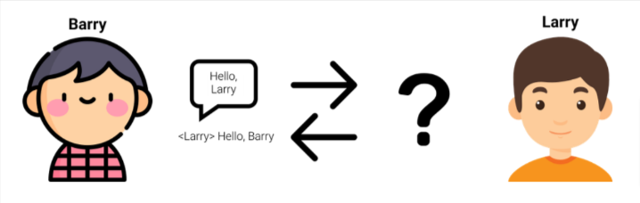
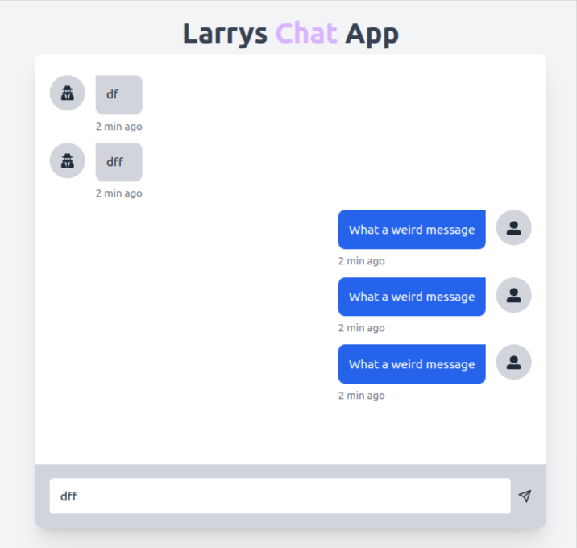

<p align="center">
    
</p>

# Larrys Chat App

This is an app bootstrapped according to the [init.tips](https://init.tips) stack, also known as the T3-Stack. 

## What Tech used

- [Next-Auth.js](https://next-auth.js.org)
- [Prisma](https://prisma.io)
- [TailwindCSS](https://tailwindcss.com)
- [tRPC](https://trpc.io)

## Description

Barry and Larry are friends, and have long been using the go-to messaging apps of WhatsApp, Signal, and Facebook messenger to send each other texts and memes. However, as software developers, they have recently come to the conclusion that none of these solutions are edgy enough to match their technical brilliance. As such, Barry and Larry have decided to build their own messaging service. They both agree to making their own half of a two-way messaging system, that can send and receive messages between Barry and Larry. Barry builds a beautiful front-end application containing a text input where Barry can write a message to Larry, and send it by clicking the send button. Barry’s application then waits to receive a response from Larry, which will be displayed on Barry’s screen.

Barry expects Larry to build a similar application, which can send a message back to Barry, and display it on Barry’s screen. There is just one caveat: Larry is lazy. Software developer levels of lazy. Larry therefore decides that instead of bothering with an application, user input and dealing with Barry’s questions, Larry will simply build an API that automatically responds to Barry’s requests instantly, with messages based on some simple rules.

The Task: build Barry’s front-end application, which can be used to communicate with Larry. Larry has hosted his REST API here: `<https://larrys-api.herokuapp.com/>`. 

You can send a request to its `/message` endpoint with a JSON payload containing a message , for Larry.

```
{
    "message": "Olla, Kommo tale tale!"
}
```

## How to run

- `npm run build`
- `npm run dev`
- `npm start`

<p align="center">
    
</p>
